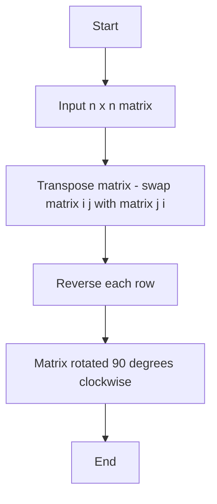
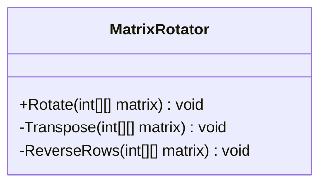
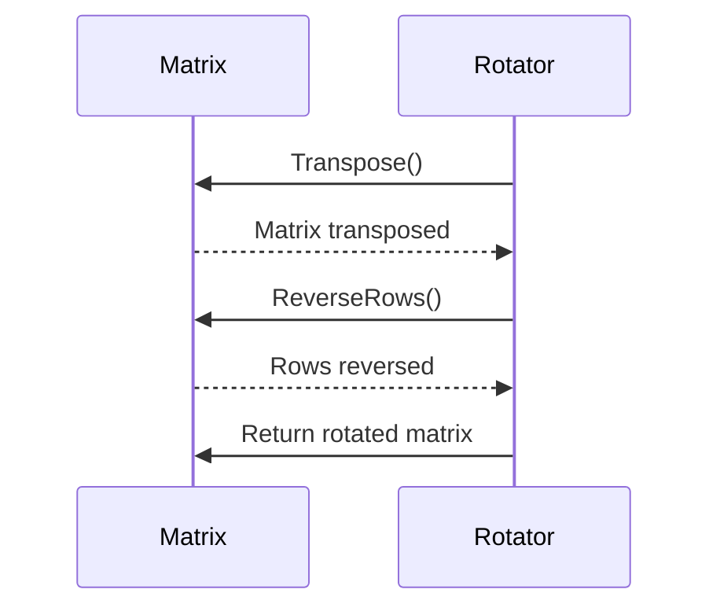

<div align="center">

# Rovy Week 6 Challenge Labs

### Rotate Matrix 90 Degrees Clockwise — Optimal In-Place Algorithm
#### MSSA CAD Program — Week 6


-orange?style=for-the-badge)
-green?style=for-the-badge)

</div>

---

## Overview

This project implements the **optimal in-place algorithm** for rotating any **n x n matrix 90 degrees clockwise** using only two steps:

- **Step 1 — Transpose:** Flip the matrix across its diagonal
- **Step 2 — Reverse Each Row:** Mirror each row left to right

No extra matrix needed. Pure O(n²) time, O(1) space.

---

## Full C# Implementation

```csharp
using System;

namespace Rovy_Week6_Challenge_Labs
{
    internal class Program
    {
        static void Main(string[] args)
        {
            var matrix = new int[][]
            {
                new int[] { 1, 2, 3 },
                new int[] { 4, 5, 6 },
                new int[] { 7, 8, 9 }
            };

            Console.WriteLine("Original Matrix:");
            PrintMatrix(matrix);

            Rotate(matrix);

            Console.WriteLine("\nRotated Matrix (90 Degrees Clockwise):");
            PrintMatrix(matrix);
        }

        // Rotate matrix 90 degrees clockwise in place
        static void Rotate(int[][] matrix)
        {
            int n = matrix.Length;

            // Step 1: Transpose
            for (int i = 0; i < n; i++)
            {
                for (int j = i + 1; j < n; j++)
                {
                    var temp = matrix[i][j];
                    matrix[i][j] = matrix[j][i];
                    matrix[j][i] = temp;
                }
            }

            // Step 2: Reverse each row
            for (int i = 0; i < n; i++)
            {
                Array.Reverse(matrix[i]);
            }
        }

        static void PrintMatrix(int[][] matrix)
        {
            foreach (var row in matrix)
            {
                Console.WriteLine(string.Join(" ", row));
            }
        }
    }
}
```

---

## Problem Summary

Given any n x n matrix, rotate it **90 degrees clockwise in place**.

```
Input:          Output:
1  2  3         7  4  1
4  5  6    -->  8  5  2
7  8  9         9  6  3
```

### Constraints
- Must rotate in place (no new matrix allowed)
- Must handle any valid n x n matrix
- Must be the optimal solution

---

## Algorithm Breakdown

### Step 1 — Transpose the Matrix
Swap every element across the main diagonal (`matrix[i][j]` with `matrix[j][i]`).

```
Before Transpose:     After Transpose:
1  2  3               1  4  7
4  5  6     -->       2  5  8
7  8  9               3  6  9
```

### Step 2 — Reverse Each Row
Flip each row left to right.

```
1  4  7  -->  7  4  1
2  5  8  -->  8  5  2
3  6  9  -->  9  6  3
```

### Final Result
```
7  4  1
8  5  2
9  6  3
```

---

## Example Outputs

### 3 x 3 Example

| | Col 0 | Col 1 | Col 2 |
|---|---|---|---|
| **Original Row 0** | 1 | 2 | 3 |
| **Original Row 1** | 4 | 5 | 6 |
| **Original Row 2** | 7 | 8 | 9 |

| | Col 0 | Col 1 | Col 2 |
|---|---|---|---|
| **Rotated Row 0** | 7 | 4 | 1 |
| **Rotated Row 1** | 8 | 5 | 2 |
| **Rotated Row 2** | 9 | 6 | 3 |

### 4 x 4 Example

```
Original:               Rotated:
 5   1   9  11          15  13   2   5
 2   4   8  10    -->   14   3   4   1
13   3   6   7          12   6   8   9
15  14  12  16          16   7  10  11
```

---

## Time and Space Complexity

| Operation | Complexity |
|---|---|
| Transpose | O(n²) |
| Reverse Rows | O(n²) |
| **Total Time** | **O(n²)** |
| **Extra Space** | **O(1)** |

This is the **best possible solution** — you cannot rotate a matrix faster than O(n²) because every element must be visited at least once.

---

## Mermaid Diagrams

### Algorithm Flowchart



### UML Class Diagram



### Sequence Diagram



---

## Folder Structure

```
Rovy-Week6-Challenge-Labs/
├── Program.cs
├── README.md
├── .gitignore
├── LICENSE
├── docs/
├── screenshots/
└── .github/
```

---

<div align="center">

**Built with discipline. Powered by C#.**
*MSSA CAD Program — Week 6 | brovy23-GD*

</div>
